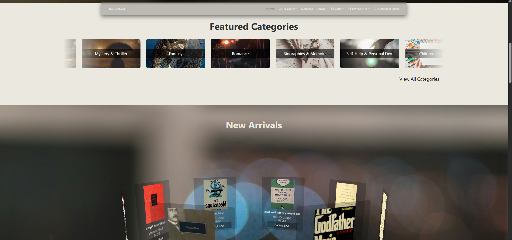
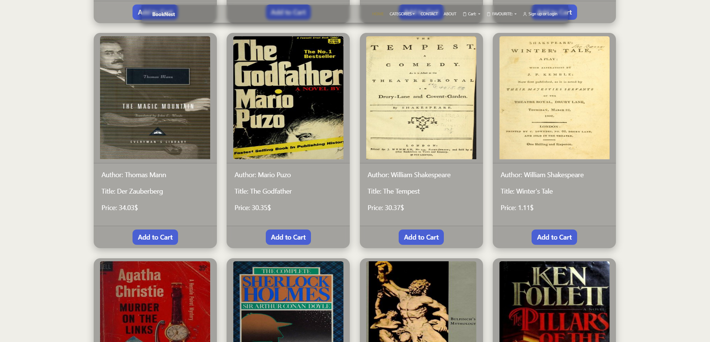
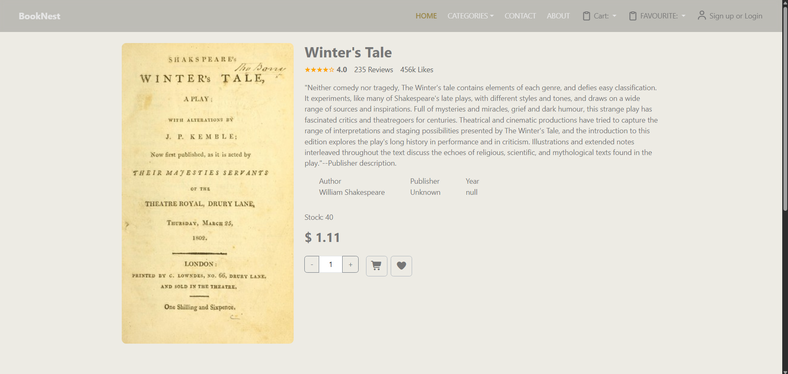
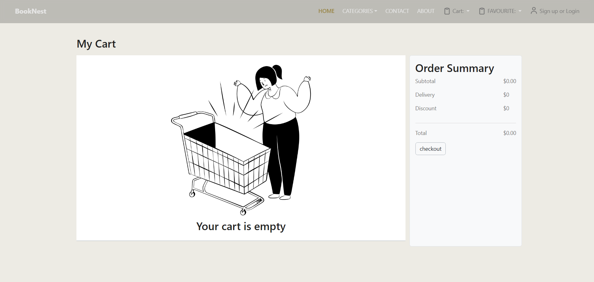
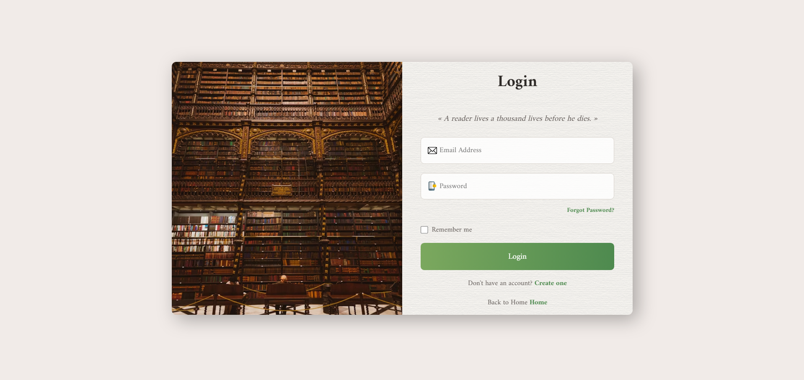

# ITITeam3BookShop
## Overview  
ITITeam3BookShop is a responsive, client-side-only web application that allows browsing and purchasing books. Developed by Team 3 at ITI to demonstrate front-end skills using HTML, CSS, JavaScript, and Bootstrap.

## Features
- Responsive, mobile-first design
- Shared navbar and layout across pages
- Dynamic book catalog generated from JSON data
- Basic client-side login/logout, cart, and favorites functionality
- Admin and seller dashboards for managing content

## Project Structure
.vscode/ # Editor settings
Assets/ # Media assets (images/icons)
Css/ # Custom stylesheet(s)
Js/ # JavaScript logic (cart, navigation, etc.)
adminPanel/ # Admin interface UI
partials/ # Shared HTML components (e.g., navbar)
seller_dashboard/ # Seller interface UI
booksv3.0.json # Sample book data
about.html # About page
admin_seller.html # Combined admin/seller interface
cart.html # Shopping cart view
contact.html # Contact form/page
favourite.html # Wishlist/favorites view
home.html # Landing page
index.html # Entry point
log_reg.html # Login/register interface
payment.html # Payment/checkout view
product-details.html # Single book detail page
productCatalog.html # Book catalog page
README.md # Project overview
LICENSE # MIT license

## 🖼️ Screenshots

### Homepage


### Book Catalog


### Product Details


### Cart


### Login & Register



## How to Use
1. Download or clone the repo:
   ```bash
   git clone https://github.com/karshfish/ITITeam3BookShop.git
Contributors

Created by Team 3 at ITI.
